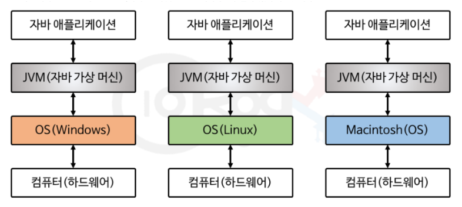
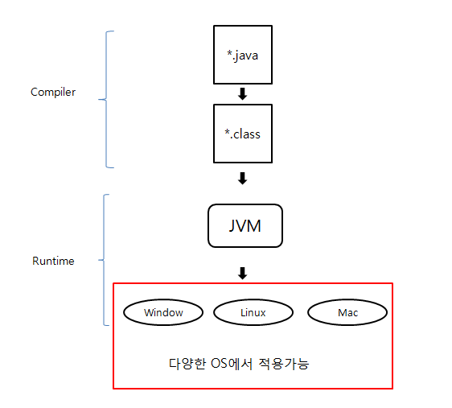
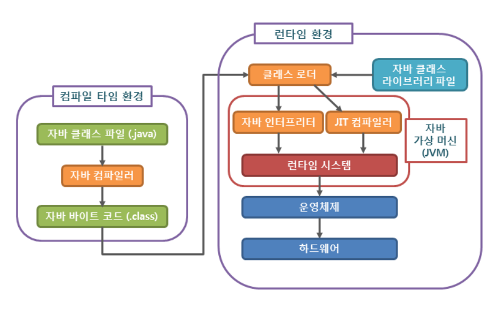
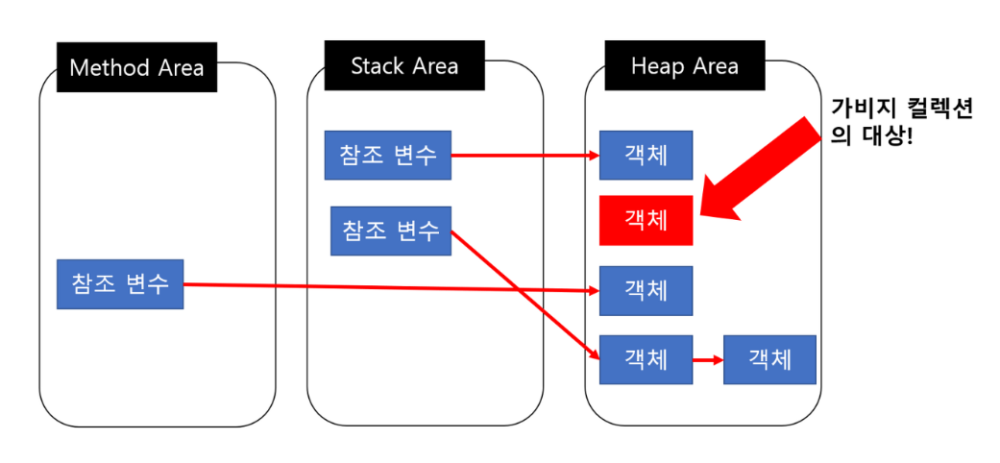
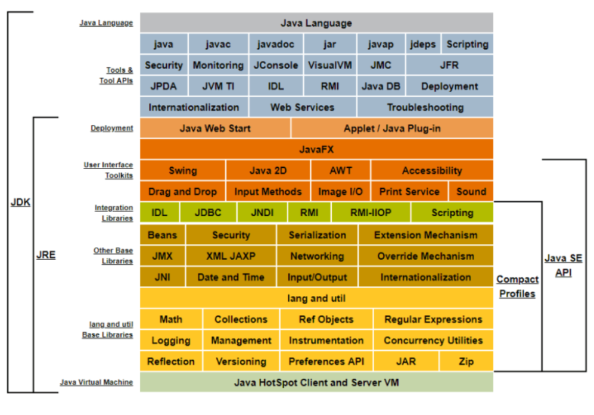

<aside>
📌 자바와 자바의 특징에 대해서 공부하기

</aside>

### JAVA란 무엇인가?

JAVA란 썬 마이크로 시스템즈에서 개발하여 1996년에 공식적으로 발표한 객체 지향 프로그램이다.

### 자바의 특징

- 자바의 가장 중요한 특징은 **운영체제(Operating System)에 독립적**이라는 것이다. 자바로 작성된 프로그램은 운영체제의 종류에 관계없이 실행이 가능하기 때문에, 운영체제에 따라 프로그램을 전혀 변경하지 않고도 실행이 가능하다. 이것은 JVM(Java Virtual Machine)을 통해서 가능한 것인데, 자바 응용프로그램은 운영체제나 하드웨어가 아닌 JVM하고만 통신하고 JVM이 자바 응용프로그램으로부터 전달 받은 명령을 해당 운영체제가 이해할 수 있도록  변환하여 전달한다. 자바로 작성된 프로그램은 운영체제에 독립적이지만 JVM은 운영체제에 종속적이어서 썬 마이크로 시스템즈에서는 여러 운영체제에 설치할 수 있는 서로 다른 버전의 JVM을 제공하고 있다. 그래서 자바로 작성된 프로그램은 운영체제와 하드웨어에 관계없이 실행 가능하며 이것을 '한번 작성하면, 어디 서나 실행된다.(Write once, run anywhere)‘ 표현하기도 한다.
    - 자바는 운영체제에 독립적이지만 설치할 때는 운영체제를 구분하여 설치해야 한다. 그 이유는 자바가 운영체제나 하드웨어가 아닌 JVM과 통신하기 때문이다.
    
- 자바는 프로그래밍의 대세로 자리 잡은 **객체 지향 프로그래밍 언어(object-oriented pro-gramming language) 중의 하나**로 객체 지향 개념의 특징인 **상속, 캡슐화, 다형성이 잘 적용된 순수한 객체 지향 언어**라는 평가를 받고 있다. 객체 지향 언어의 장점에는 코드 재사용성, 유지보수가 용이함으로 대규모 프로젝트에 적합하다는 것이고, 단점으로는 처리 속도가 느리고 객체에 따른 용량 증가, 설계 단계에 많은 시간이 소요된다는 것이 있다.
    - 객체 지향이란 단어 뜻 그대로 프로그램(실제 세계)를 객체(사물)라는 기본 단위로 나누고 이 객체들 간의 상호작용을 기본 개념으로 한다.
    - 상속은 클래스 개념이 도입되면서 상속을 통해 부모 클래스의 속성과 기능을 이어받아 사용하는 것을 말한다.
    - 캡슐화는 연관 있는 변수와 메소드를 묶어주는 작업을 말한다.
    - 추상화란 객체에서 공통된 속성과 행위를 추출하는 것을 의미한다.
    - 다형성이란 프로그래밍 언어의 자료형 체계의 성질을 나타내는 것으로 동일한 변수, 함수명 등이 다양한 방법으로 기능하는 것을 말하며, 오버라이딩(Overriding), 오버로딩(Overloading)이란 형태로 제공된다.
    - 오버라이딩(Overriding) - 부모 클래스부터 상속받은 메소드를 자식 클래스에서 재정의
    - 오버로딩(Overloading) - 같은 이름의 메소드를 매개변수의 유형과 개수가 다르게 함.
- 자바의 연산자와 기본 구문은 C++에서, 객체 지향 관련 구문은 small talk이라는 객체 지향 언어에서 가져왔다. 각 언어들의 장점은 취하면서 복잡하고 불필요한 부분은 과감히 제거하여 단순화함으로서 쉽게 배울 수 있으며, 간결하고 이해하기 쉬운 코드를 작성할 수 있도록 하였다.객체 지향 언어의 특징에는 재사용성과 유지 보수의 용이성 등이 있다.

- 자바로 작성된 프로그램이 실행되면, **가비지 컬렉터(garbage collector)가 자동적으로 메모리를 관리**해주기 때문에 프로그래머는 메모리를 따로 관리 하지 않아도 된다. 자동으로 메모리를 관리한다는 것이 다소 비효율적인 면도 있지만, 프로그래머가 보다 프로그래밍에 집중할 수 있도록 도와준다.

- 인터넷과 대규모 분산 환경을 염두에 둔 까닭인지 풍부하고 다양한 네트워크 프로그래밍 라이브러리**(Java API)를 통해** 비교적 짧은 시간에 네트워크 관련 프로그램을 쉽게 개발할 수 있도록 **네트워크와 분산 처리를 지원**한다.

- 일반적으로 **멀티 쓰레드(multi-thread)의 지원**은 사용되는 운영체제에 따라 구현 방법도 상이하며, 처리 방식도 다르다. 그러나 자바에서 개발되는 멀티 쓰레드 프로그램은 시스템과는 관계없이 구현 가능하며, 관련된 라이브러리(Java API)가 제공되므로 구현이 쉽다. 그리고 **여러 쓰레드에 대한 스케줄링(scheduling)을 자바 인터프리터가 담당**하게 된다.

- 자바는 **동적 로딩을 지원하기 때문에 실행 시에 모든 클래스가 로딩되지 않고 필요한 시점에 클래스를 로딩하여 사용**할 수 있다는 장점이 있다. 그 외에도 일부 클래스가 변경되어도 전체 애플리케이션을 다시 컴파일하지 않아도 되며, 애플리케이션의 변경사항이 발생해도 비교적 적은 작업만으로도 처리할 수 있는 유연한 애플리케이션을 작성할 수 있다.

---

**자바의 특징**

- 운영체제(Operating System)에 독립적
    - JVM(Java Virtual Machine) - 자바 구동 원리
- 객체 지향 언어(object-oriented pro-gramming language)
    - 상속
    - 캡슐화
    - 다형성
    - 추상화
    - 오버라이딩
    - 오버로딩
- 자동 메모리 관리(Garbage Collection)
    - 자바 메모리 구조
- 네트워크와 분산 처리 지원
- 멀티 쓰레드(multi-thread)
    - 쓰레드
    - 인터프리터
- 동적 로딩(Dynamic Loading)

<aside>
📌 자바 컴파일 세부 단계

</aside>

전통적으로 컴파일이라고 하면 어떤 언어로 된 소스 코드를 기계가 인식할 수 있는 네이티브 코드로 변환하는 과정을 의미하지만, 자바에서 컴파일은 자바 언어로 된 코드를 JVM이 인식할 수 있는 JVM 명령어 코드(바이트 코드)로 변환하는 것을 의미한다. (JIT 컴파일러가 하는 컴파일은 바이트 코드로 변환하는 것이 아니라 바이트 코드를 네이티브 코드로 변환하는 것을 의미한다.)

1. Lexical Analysis (어휘 분석)
2. Syntax Analysis (구문 분석)
3. Symantic Analysis(의미 분석)
4. Intermediate Code Generation(중간 코드 생성)
5. Code Optimization(중간 코드 최적화)

<aside>
📌 JVM (Java Virtual Machine) - 자바 가상 머신

</aside>

JVM은 'Java virtual machine'을 줄인 것으로 '**자바를 실행하기 위한 가상 기계**'라고 할 수 있다.

'가상 기계(virtual machine)'는 소프트웨어로 구현된 하드웨어를 뜻하는 넓은 의미의 용어이며, 컴퓨터의 성능이 향상됨에 따라 점점 더 많은 하드웨어들이 소프트웨어화 되어 컴퓨터 속으로 들어오고 있다.

이와 마찬가지로 '가상 컴퓨터(virtual computer)'는 실제 컴퓨터(하드웨어)가 아닌 소프트웨어로 구현된 컴퓨터라는 뜻으로 컴퓨터 속의 컴퓨터라고 생각하면 된다.

자바로 작성된 어플리케이션은 모두 이 가상 컴퓨터(JVM)에서만 실행되기 때문에, 자바 어플리케이션이 실행되기 위해서는 반드시 JVM이 필요하다.

일반 어플리케이션의 코드는 OS만 거치고 하드웨어로 전달되는데 JAVA 어플리케이션은 JVM을 거치고, 실행 시에 해석(interpret)되기 때문에 속도가 느리다는 단점을 가지고 있다.

자바는 운영체제에 독립적이지만, JVM은 운영체제에 종속적이다. JVM에 포함된 JIT Compiler가 바이트 코드를 운영체제별로 다르게 변환해야 하기 때문이다. JVM이 해당 운영체제가 이해할 수 있는 언어로 변환해주는 것은 JIT(Just In Time) compiler가 수행한다.

작성한 코드는 src 디렉토리에 .java 파일로 저장된다. .java 파일은 자바 컴파일러를 통해 bin 디렉토리에 .class 파일로 저장되는데 이 때, 자바 바이트 코드로 저장된다. bytecode는 JVM이 실행하는 명령어의 형태이다. 자바 컴파일러에 의해 변환되는 코드의 명령어 크기가 1바이트라서 자바 바이트 코드라고 불린다. 이러한 자바 바이트 코드의 확장자는 .class이다. 자바 컴파일러는 자바를 설치하면 javac.exe라는 실행 파일 형태로 설치된다.

- 자바 가상 머신은 자바 인터프리터(Java Interpreter), class loader, JIT 컴파일러(Just-In-Time compiler), garbage collector로 구성되어 있다.
    - 자바 인터프리터(Java Interpreter)는 자바 컴파일러에 의해 변환된 자바 바이트 코드를 읽고 해석하는 역할을 하는 것이다.
    - 자바는 동적으로 클래스를 읽어오므로, 프로그램이 실행 중인 런타임에서야 모든 코드가 자바 가상 머신과 연결된다. 이렇게 동적으로 클래스를 로딩 해주는 역할을 하는 것이 바로 클래스 로더(class loader)이다.
    - JIT 컴파일러(Just-In-Time compiler)란 프로그램이 실행 중인 런타임에 실제 기계어로 변환해 주는 컴파일러를 의미한다. 동적 번역(dynamic translation)이라고도 불리는 이 기법은 프로그램의 실행 속도를 향상 시키기 위해 개발되었다.
    - garbage collector는 사용하지 않는 메모리를 자동으로 회수해준다.

자바 언어로 개발된 프로그램을 실행하면 JVM은 OS로부터 메모리를 할당한다.

- 자바 컴파일러(javac)가 자바 소스 코드(.java)를  자바 바이트 코드(.class)로 컴파일한다.
    - 자바 바이트 코드는 특정 하드웨어가 아닌 가상 컴퓨터에서 돌아가는 실행 프로그램을 위한 이진 표현법이다. 어떤 플랫폼에도 종속되지 않고 실행될 수 있는 가상 머신용 기계어 코드이다. (CPU가 아닌 가상 머신에서 이해할 수 있는 코드를 위한 이진 표현법이다. 즉, 가상 머신이 이해할 수 있는 0과 1로 구성된 이진 코드를 의미함.)
    - 자바 바이트 코드는 다시 JIT 컴파일러에 의해 바이너리 코드로 변환된다. 바이너리 코드는 컴퓨터가 인식할 수 있는 0과 1로 구성된 이진 코드를 의미한다.
    - 자바 바이트 코드를 만드는 이유는 아래처럼 중간 단계를 하나 둬서 간접화를 통해 경우의 수를 낮추고 효율을 높이기 위해 중간 코드를 생성한다. 자바 소스 파일(.java) → 자바 컴파일러(javac) → 자바 바이트 코드(.class)

class loader를 통해 JVM Runtime Data Area를 로딩한다. Runtime Data Area에 로딩 된 .class들은 Execution Engine(실행 엔진 - 로드된 바이트 코드를 실행하는 런타임 모듈)을 통해 해석한다.

해석된 바이트 코드는 Runtime Data Area의 각 영역에 배치되어 수행하며 이 과정에서 Execution Engine에 의해 GC의 작동과 스레드 동기화가 이루어진다.

Runtime Data Area(런타임 데이터 영역)은 JVM의 메모리 영역으로 자바 어플리케이션을 실행할 때 사용되는 데이터들을 적재하는 영역이다.

모든 스레드가 공유해서 사용하는 영역(GC의 대상)에는 힙 영역(Heap Area), 메서드 영역(Method Area)가 있고,

- 스레드마다 하나씩 생성하는 스택 영역(Stack Area), PC 레지스터(PC Register), 네이티브 메서드 스택(Native Method Stack)이 있다.
    - 힙 영역은 new 키워드로 생성된 객체와 배열이 생성되는 영역으로, 주기적으로 GC가 제거하는 영역이다.
    - 메서드 영역은 클래스 멤버 변수의 이름, 데이터 타입, 접근 제어자 정보와 같은 각종 필드 정보들과 메소드 정보, 데이터 타입, static 변수 등이 생성되는 영역이다.
    - 스택 영역은 지역변수, 파라미터, 리턴 값, 연산에 사용되는 임시 값 등이 생성되는 영역이다.
    - PC Register는 Thread가 생성될 때마다 생성되는 영역으로 프로그램 카운터, 즉 현재 스레드가 실행되는 부분의 주소와 명령을 저장하고 있는 영역이다.
    - 네이티브 메서드 스택은 자바 이외에 언어로 작성된 네이티브 코드를 실행할 때 사용되는 메모리 영역으로 일반적인 C 스택을 사용한다. 자바 컴파일러에 의해 변환된 자바 바이트 코드를 읽고 해석하는 역할을 하는 것이 자바 인터프리터이다.

자바는 동적으로 클래스를 읽어오므로, 프로그램이 실행중인 런타임에서 모든 코드가 JVM과 연결된다.

이 때, 동적으로 클래스를 로딩해주는 역할을 하는 것이 Class Loader이다.

.java 소스를 컴파일러가 컴파일하면 .class 파일이 생성되는데 클래스 로더는 .class 파일을 묶어서 JVM이 운영체제로부터 할당받은 메모리 영역인 Runtime Data Area로 적재한다.

<aside>
📌 Garbage Collector - 가비지 컬렉터

</aside>

가비지 컬렉션 영어로 Garbage Collection으로 줄여서 GC라고도 부른다.

가비지 컬렉션은 자바의 메모리 관리 방법 중의 하나로 JVM의 Heap 영역에서 동적으로 할당했던 메모리 영역 중 **필요없게 된 메모리 영역을 주기적으로 삭제하는 프로세스**를 말한다.

가바지 컬렉션은 개발자가 메모리 누수(Memory Leak) 문제에 대해 완벽하게 관리하지 않아도 된다는 장점이 있지만, 단점은 개발자가 메모리가 언제 해제되는지 정확하게 할수 없고, GC가 동작하는 동안에는 다른 동작을 멈추기 때문에 오버헤드가 발생한다는 것이다. 이로 인해 GC가 너무 자주 실행되면 소프트웨어 성능 하락의 문제가 되기도 한다. 이러한 특성으로 인해 실시간으로 계속 동작해주어야 하는 시스템들의 경우 GC의 사용이 적합하지 않을 수 있다.

객체들은 실질적으로 Heap 영역에서 생성되고 메소드 영역이나 스택 영역 등 Root Area에서는 Heap Area에 생성된 객체의 주소만 참조하는 형식으로 구성된다. 하지만 이렇게 생성된 Heap Area의 객체들이 메소드가 끝나는 등의 특정 이벤트들로 인해 Heap Area 객체의 메모리 주소를 가지고 있는 참조 변수가 삭제되는 현상이 발생하면 위의 그림에서의 빨간색 객체와 같이 Heap 영역에서 어디서든 참조하고 있지 않은 객체들이 발생한다. 이러한 객체들을 Unreachable하다고 하며, 주기적으로 GC가 제거해준다.

<aside>
📌 JDK(Java Development Kit) - 자바 개발 키트

</aside>

JRE는 자바 실행 환경(Java Runtime Environment)의 약자로, 자바로 만들어진 프로그램을 실행시키는데 필요한 라이브러리들과 각종 API, JVM이 포함되어 있다.

JDK는 자바 개발 키트(Java Development Kit)로 개발 시 필요한 라이브러리들, javac, javadoc 등의 개발도구를 포함하고 있고 JRE도 함께 포함되어 있다.
